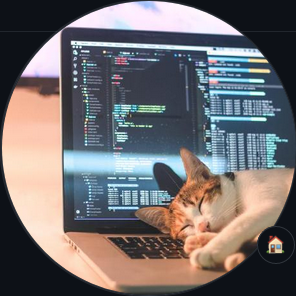

<!-- PROJECT LOGO -->
 

  
  <h3 align="center">Circle Landing Agency Website</h3>
  <a href="https://midterm-project.vercel.app/">Visit Website</a>

<!-- TABLE OF CONTENTS -->

  
Table of Contents

  <ol>
    <li>
      <a href="#acerca-del-proyecto">Acerca del Proyecto</a>
      <ul>
        <li><a href="#construido-con">Construido Con</a></li>
      </ul>
    </li>
    <li>
    <a href="#roadmap">Roadmap</a>
     <ul>
     <li><a href="#backlog">Back log</a></li>
     <li><a href="#todo">To do</a></li>
     <li><a href="#doing">Doing</a></li>
     <li><a href="#done">Done</a></li>
      </ul>
    </li>
    <li><a href="#acerca">Acerca</a></li>
    <li><a href="#agradecimientos">Agradecimientos</a></li>
    <li><a href="#desafío-técnico">Desafío Técnico</a></li>
    <li><a href="#grande-error">Grande Error</a></li> 
  </ol>

<!-- ABOUT THE PROJECT -->

## Acerca del Proyecto

Este proyecto tiene como objetivo construir y desplegar el sitio web que se muestra en la imagen de manera totalmente responsiva y utilizando las tecnologías que hemos aprendido hastael momento en el bootcamp de Front-End-Development: HTML, CSS y JavaScript.

La idea es recrear el diseño preexistente y crear algunas interacciones con el DOM, utilizando lo que hemos aprendido sobre JavaScript hasta ahora. Al finalizar, este proyecto se desplega en Netlify, utilizando la CLI de Git para hacerlo.

(<a href="#readme-top">back to top</a>)

### Construido Con

    - HTML
    - CSS
    - JavaScript
    - Git
    - Netlify CLI
    - Trello

(<a href="#readme-top">back to top</a>)

## Roadmap

> [Link al Tablero de Trello](https://trello.com/invite/b/OYze7oF3/ATTIf0e03f9993341c15f6ca84da4fbc42f93A2B8C64/proyecto1)

El desarrollo del proyecto se divide en varias etapas, organizadas utilizando Trello para detallar cada día.

El tablero utiliza la metodología Kanban, que está dividida en las siguientes secciones:

#### Backlog

Aquí se listan todas las tareas que son necesarias para completar el proyecto. Esto incluyela creación de la estructura básica del HTML, el estilo con CSS, la creación de las interacciones con la API con JavaScript y la implementación de la funcionalidad en el sitio web.

#### To Do

En esta etapa, se organizarán las tareas para el día, incluyendo la creación de la estructura básica del HTML y la esquematización de la arquitectura del proyecto.

#### Doing

Esta es la etapa en la que se detallan las tareas en las que se está actualmente trabajando.

#### Done

Esta es la etapa final donde las tareas completadas son listadas.

(<a href="#readme-top">back to top</a>)

<!-- Acerca de mi -->

## Sobre mi

Mi nombre es Nico D'Alessandro y soy "el desarrollador" detrás de este primer proyecto web. 

Tengo amplia experiencia utilizando herramientas para análisis de datos tales como SQL y Python, pero en la busqueda de nuevas oportunidades para expandir mis habilidades he decidido realizar este bootcamp. 

La creación de este sitio web representa una forma de practicar y poner en práctica por primera vez la realización de un proyecto web y así poner a prueba mis habilidades en HTML, CSS y JavaScript.

Si tienes alguna pregunta sobre el proyecto no dudes en contactar conmigo, te dejo a continuación mis datos de contacto:

- Twitter: [@nicodalessa](https://twitter.com/nicodalessa)
- Correo electrónico: nicodalessandro11@gmail.com

Aquí dejo los enlaces relevantes al proyecto:

- Enlace del proyecto: [https://github.com/nicodalessandro11/proyecto1](link)
- Enlace de presentación TBD: [Inserta aquí tu enlace de presentación](link)

(<a href="#readme-top">back to top</a>)

<!-- ACKNOWLEDGMENTS -->

## Agradecimientos

Gracias a todos los que me apoyaron en este proyecto, principalmente a los compañeros del curso y al profesor del Bootcamp.

(<a href="#readme-top">back to top</a>)

## Desafío Técnico

A través del desarrollo de este proyecto, me enfrento a varios desafíos técnicos, ya que aunque tengo una formación como analista de datos con experiencia en Python y SQL, este es mi primer proyecto creando una página web desde cero.

Uno de los desafíos más grandes es la estructura HTML. Aunque este lenguaje pareciera ser menos complejo que muchos otros lenguajes de programación, organizar eficazmente el contenido y asegurar de que el sitio se renderiza correctamente en todos los navegadores presenta para mi un gran desafío y una nueva forma de utilizar la programación.

Además, trabajar con CSS también es un desafío. Crear un diseño que sea estéticamente agradable y completamente responsivo no es tarea fácil.

En resumen, a pesar de los desafíos, este proyecto es en lo personal una gran oportunidad para aprender y crecer como desarrollador web. Espero que mi experiencia pueda ayudar y motivar a otros que com yo, están comenzando en esta emocionante área del desarrollo.

(<a href="#readme-top">back to top</a>)

## Grande Error

TBD.-

(<a href="#readme-top">back to top</a>)

